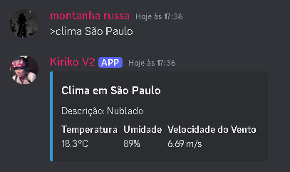

# Comandos para Bots do Discord
 Explore a vanguarda da automação no Discord com este repositório repleto de comandos personalizados e inovadores para bots. Estes comandos elevam a interação em servidores a novos patamares. Desde funções de moderação avançadas até sistemas de jogos envolventes, cada comando foi meticulosamente projetado para oferecer uma experiência única e memorável. Com uma documentação abrangente e exemplos de uso claros, este repositório é um tesouro de soluções prontas para serem integradas em qualquer bot do Discord, simplificando e ampliando a sua funcionalidade de forma inteligente e elegante.

## Como instalar

### 1. Pré-requisitos

- **Python 3.8 ou superior**: Certifique-se de que você tenha o Python instalado. Caso contrário, faça o download [aqui](https://www.python.org/downloads/).
- **pip**: O gerenciador de pacotes do Python já vem instalado com o Python 3.x. Verifique se está instalado e atualizado:
  
  ```bash
  python -m ensurepip --upgrade
  ```

## Exemplo do comando clima:
<p align="center">
  
</p>

## Exemplo do comando tradutor:
<p align="center">
  
</p>

## Exemplo do comando ping:
<p align="center">
  
</p>
